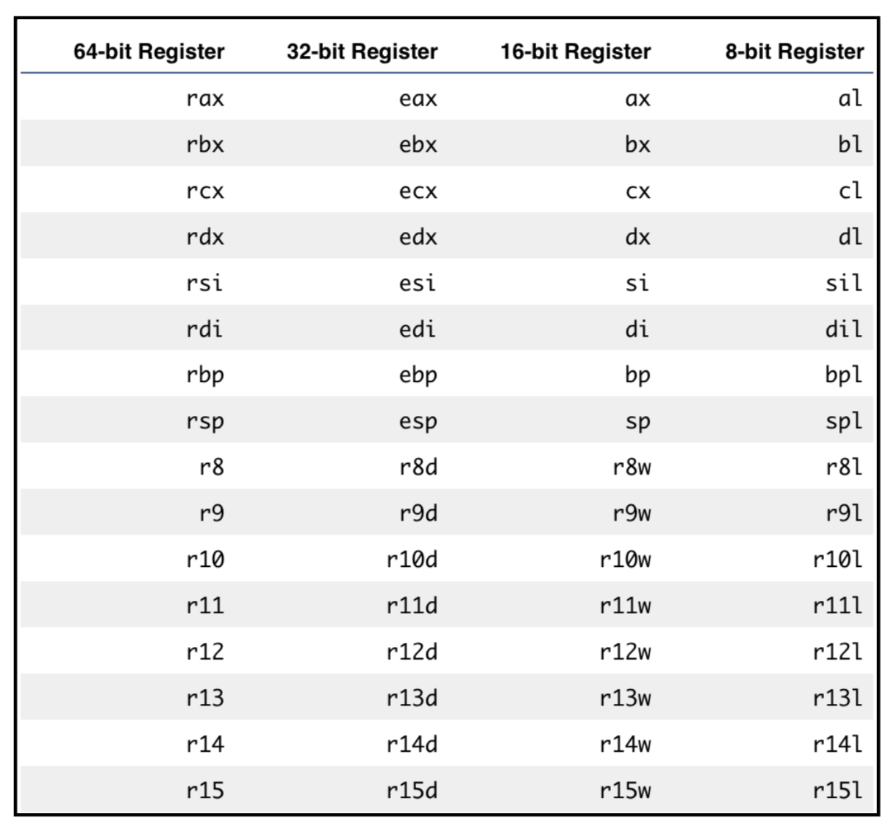

# Registers

## Assembly Register Calling Convention

x86_64 is a 64-bit architecture, which means every address can hold up to 64 1s or 0s.

x86_64 is the architecture most likely used on your macOS computer.

ARM64 architecture is used on mobile devices such as your iPhone where limiting energy consumption is critical.

## Registers in x86_64

RAX, RBX, RCX, RDX, RDI, RSI, RSP, RBP and R8 through R15.

|arg1|arg2|arg3|arg4|arg5|arg6|argx...|
|--|--|--|--|--|--|--|
|RDI|RSI|RDX|RCX|R8|R9|R10+|


```shell
# read registers
(lldb) register read
```

### RAX 

Stores the return value.

### RIP

RIP register 存的是方法的地址，通过修改 RIP 寄存器的器的值可以动态修改方法的实现，

```shell
# 1. 在方法定义那行下断点

# 查看当前方法的地址（非必须）
(lldb) cpx $rip
> (unsigned long) $2 = 0x0000000100007b80

# 2. 搜索想要替换的方法，其中的 range 左边就是方法的起始地址
(lldb) image lookup -rvn '^Register.*goodMethod'
> Symbol: id = {0x00000308}, range = [0x0000000100007c50-0x0000000100007d20), name="Registers.AppDelegate.goodMethod() -> ()", mangled="$S9Registers11AppDelegateC10goodMethodyyF"

# 3. 修改 RIP 的值
(lldb) register write rip 0x0000000100007c50
```




## Registers in Objective-C & Swift

RAX: used for return values, both Objective-C & Swift

### Objective-C and Swift NSObject subclass

```objc
[label setText:@"abc"];
// equals
objc_msgSend(label, "setText:", @"abc")

/*
RDI: the reference of the calling object, label
RSI: Selector, setText:
RDX: the first parameter, @"abc"
RCX: second parameter
...
*/
```

> Why you’ll never see the objc_msgSend in the LLDB backtrace?

The `objc_msgSend` family of functions perfoms a `jmp`, or `jump` opcode command in assembly. Which is called tail call optimization.

### Pure Swift

```swift
aStruct.method("first", "second")

// no objc_msgSend

/*
RDI: first parameter, "first"
RSI: second parameter, "second"
*/
```

### Examples

#### Read RDI

```shell
(lldb) b -[NSWindow mouseDown:]
# RDI is the window object (the reference of the calling object)
(lldb) po [$rdi setBackgroundColor:[NSColor redColor]]
```

#### 替换所有 [UILabel setText:] 的方法调用参数

```shell
$ xcrun simctl list | grep "iPhone X"
> iPhone X (A68E22C0-8286-4E60-BF62-92559E15A622) (Shutting Down)

$ open /Applications/Xcode.app/Contents/Developer/Applications/Simulator.app --args -CurrentDeviceUDID A68E22C0-8286-4E60-BF62-92559E15A622

$ lldb -n SpringBoard
(lldb) p/x @"Yay! Debugging"
> (__NSCFString *) $3 = 0x0000618000644080 @"Yay! Debugging"

(lldb) b -[UILabel setText:]
# 把 $rdx，也就是第一个参数，text 换成 @"Yay! Debugging" 字符串的地址
(lldb) breakpoint command add
> po $rdx = 0x0000618000644080
> continue
> DONE
```

#### hook all button action events

```shell
(lldb) b -[UIControl sendAction:to:forEvent:]
```

#### print viewController as they appear

Try attaching to an application on the iOS Simulator and map out the UIViewControllers as they appear using assembly, a smart breakpoint, and a breakpoint command.

```shell
lldb -n 'Preferences'
(lldb) b -[UIViewController viewDidLoad]
(lldb) breakpoint command add
> po $arg1
> DONE
```

### 大小端

```shell
# 当以不同的 size 输出起始地址（0x100008910）开始的内存时
# 根据大小端的不同，lldb 会按照大小分组，正确地输出内存内容

(lldb) memory read -s1 -c20 -fx 0x100008910
> 0x100008910: 0x55 0x48 0x89 0xe5 0x48 0x81 0xec 0xc0

(lldb) memory read -s2 -c10 -fx 0x100008910
# 这里的 0x4855 和上面的前两个字节刚好是反过来的
> 0x100008910: 0x4855 0xe589 0x8148 0xc0ec 0x0000 0x4c00 0x6d89 0xb8f8

(lldb) memory read -s4 -c5  -fx 0x100008910
> 0x100008910: 0xe5894855 0xc0ec8148 0x4c000000 0xb8f86d89
```
