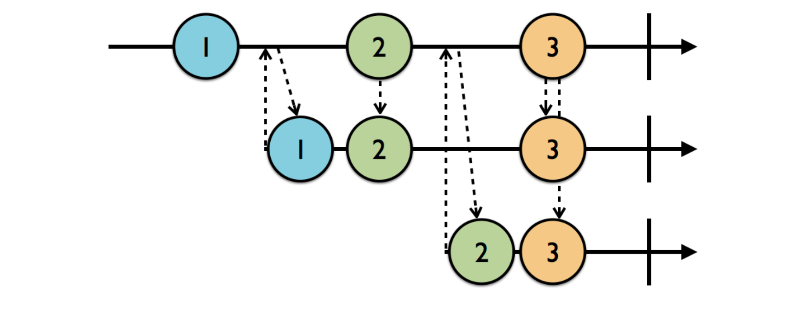

# [RxSwift](https://github.com/ReactiveX/RxSwift)

## Basic
The logo of [ReactiveX](http://reactivex.io/) is a electric eel（电鳗）.

Core issues with writing asynchronous code,

- the order in which pieces of work are performed
- shared mutable data.

Side effect, any change to the state outside of the current scope. 

## Observables
`Observable<T>` provides the ability to asynchronously produce a sequence of events that can “carry” an immutable snapshot of data T. It allows classes to subscribe for values emitted by another class over time.

An `Observable` is just a sequence.

There are many ways to create a `Observable`, `just`, `of`, `create`, etc.

### `ObservableType` protocol
An observable can emmit three types of events,

- `next`
- `completed`
- `error`

When an `Obsservable` emmits `completed` or `error` event, it can no longer emit events, that means, it's life is done.

## Subjects
Subjects act as both an `observable` and as an `observer`. The subject received `.next` events, and each time it received an event, it turned around and emitted it to its subscriber.

### PublishSubject
The `PublishSubject` only emits to current subscribers. But when a `PublishSubject` send a stop event(`.completed` or `.error`), the subscribe after that stop can also receive the event.

### BehaviorSubject
`BehaviorSubjects` work similarly to `PublishSubjects`, except they will replay the latest `.next` event to new subscribers.

You have to specify the default value when create the `BehaviorSubject`.

### ReplaySubject
It will then replay a buffer to new subscribers.

You have to specify the buffer size when create the `ReplaySubject`.

### Variable
A `Variable` wraps a `BehaviorSubject` and stores its current value as state. But it's value can not generate `.error`.

## Operators
Like transformation operators for array(`map`, `filter`, `reduce`), you can apply these simlar concept to Observables. They don't cause side effects.

## Schedulers
Just like dispatch queues.

## Credits

- The RxSwift Book